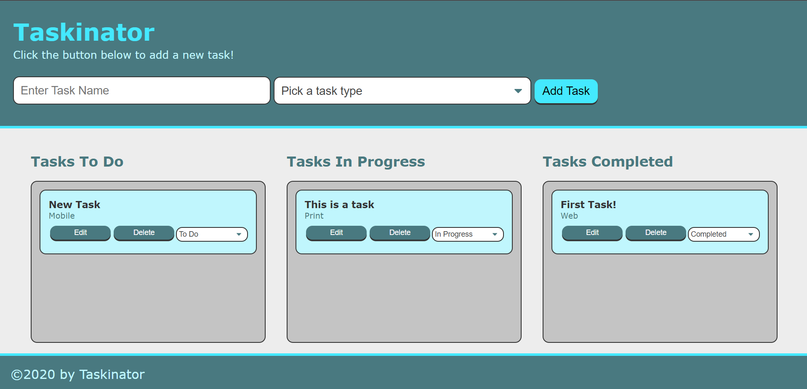

# taskinator

 ## taskinator Criteria:
        - [✔️] Programmaticaly generated DOM elements to for tasks.
        - [✔️] Be able to edit generated tasks.
        - [✔️] Be able to delete generated tasks.
        - [✔️] Move content by updating status.

Please see link below for the taskinator deployed URL: 
        https://darkjuanjo.github.io/taskinator/
        
**Below is the source code for the taskinator in GitHub. Please note that code is in assets/js. **
        https://github.com/darkjuanjo/taskinator

## See below for some screenshots

### Home Page

